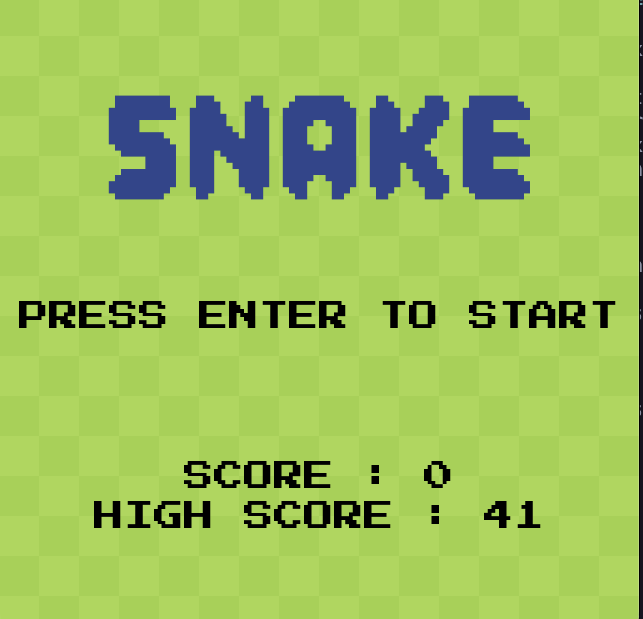

# Snake Game

A classic implementation of the Snake game using Python and the Pygame library.
>[!WARNING]
>The following instruction are for Linux and MacOS users only. Is you use Windows, that's your problem not mine.

## Description

This is a simple version of the classic Snake game. The player controls a snake that moves around a bordered screen. The objective is to eat the apples that appear on the screen to grow the snake's tail. The game ends if the snake collides with the walls or its own body. The player's score is tracked, and the high score is saved locally.

## Features

*   Classic snake gameplay
*   Score and High Score tracking
*   Sound effects for eating and game over
*   Background music
*   Increasing difficulty as the snake gets longer
*   Start screen with instructions
*   Sprites for the snake's head, body, and tail

## Requirements

*   Python3.14
*   Pygame

## Installation and Setup


1. Add permissions to the installation script and run it
    ```bash
    chmod +x ./install_pygame.sh
    ./install_pygame.sh
    ```
2. Play the game
    ```bash
    ./snake.py
    ```
## How to Play

*   Use the **Arrow Keys** (Up, Down, Left, Right) to control the direction of the snake.
*   Press the **SPACE** bar to pause the game.
*   The goal is to eat the red apples that appear on the screen.
*   Each apple eaten increases your score and the length of the snake.
*   The game is over if you run into the edge of the screen or into the snake's own body.
*   Press **ENTER** to start the game.
*   Press **ESC** to quit the game.

## Future Fixes and Improvements

*   **Input Handling:** Fix a bug where pressing arrow keys in rapid succession can cause the snake to move into itself, resulting in instant death.
*   **Stability:** Address potential game crashes.
